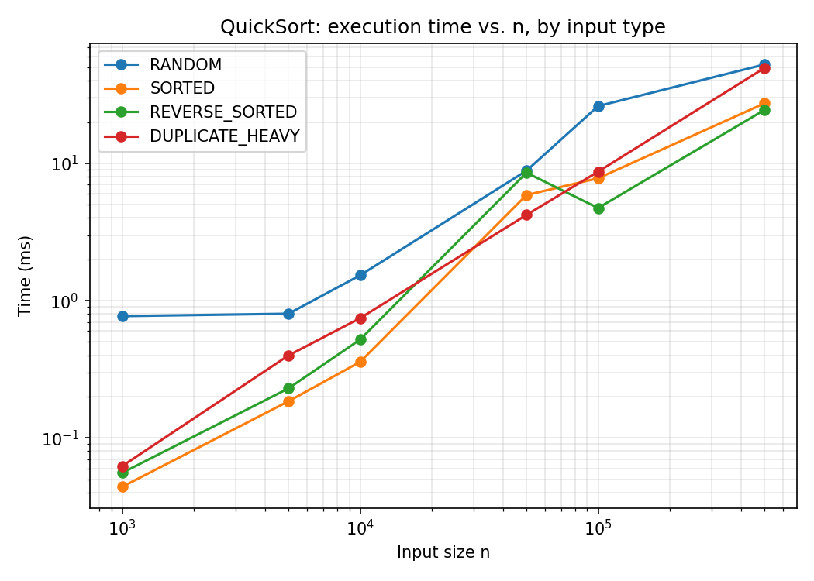
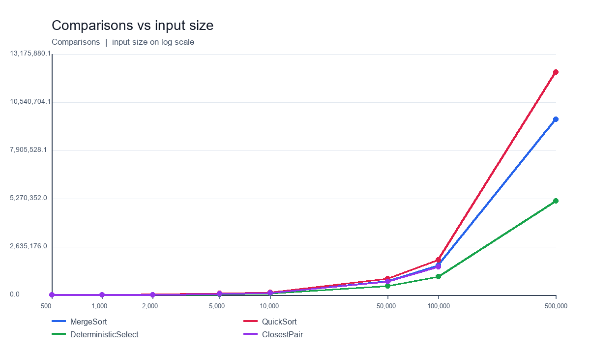

# Assignment 1: Divide-and-Conquer Algorithm Analysis

**Author:** Zhalynuly Zhassyn
**Group:** SE-2527
**Course:** Design and Analysis of Algorithms (DAA)

---

## A. Project Overview

### Purpose

The purpose of this assignment is to implement four classic divide-and-conquer
algorithms in Java, measure their real-world performance (execution time,
recursion depth, and additional metrics), and compare that measured behaviour
against the theoretical complexity predicted by the Master Theorem / recursion
tree (Akra–Bazzi) analysis.

### Implemented Algorithms

| # | Algorithm | File | Complexity |
|---|---|---|---|
| 1 | MergeSort | `MergeSorter.java` | Θ(n log n) |
| 2 | Randomized QuickSort | `QuickSorter.java` | O(n log n) expected, O(n²) worst case |
| 3 | Deterministic Select (Median-of-Medians) | `DeterministicSelector.java` | Θ(n) worst case |
| 4 | Closest Pair of Points | `ClosestPairSolver.java` | Θ(n log n) |

All four algorithms share a common `Metrics` object (`Metrics.java`) that
tracks execution time, maximum recursion depth, comparisons, and swaps, so
that every run can be measured with a consistent methodology.

---

## B. Algorithm Analysis

### 1. MergeSort

**How it works:** The array is split at its midpoint into two halves, each
half is sorted recursively, and the two sorted halves are merged in linear
time using a single **reusable auxiliary buffer** allocated once up front
(not re-allocated on every call). Sub-arrays of size ≤ 16 (`CUTOFF`) are
sorted directly with **Insertion Sort**, since the overhead of recursion and
merging is not worth it for tiny inputs — insertion sort has a smaller
constant factor and does better on nearly-sorted tiny runs.

**Complexity:** Time Θ(n log n); Space O(n) for the auxiliary buffer.

**Recurrence:** `T(n) = 2T(n/2) + Θ(n)`
By the **Master Theorem**, with `a = 2`, `b = 2`, `f(n) = Θ(n)`:
`n^(log_b a) = n^(log_2 2) = n^1 = Θ(n) = f(n)` → this is **Case 2**, so
`T(n) = Θ(n log n)`.

### 2. QuickSort (Randomized)

**How it works:** A pivot is chosen **uniformly at random** from the current
sub-array (defeating adversarial/already-sorted inputs), the array is
partitioned **in place** around it (Lomuto scheme), and then — critically —
the algorithm **recurses only on the smaller of the two partitions** and
**iterates (tail-loop) over the larger partition** instead of recursing on
both sides.

**Complexity:** Expected time Θ(n log n); worst case O(n²) (all elements
distinct, one bad pivot chosen at every single step — astronomically
unlikely with randomization, but still the theoretical bound).

**Recurrence (expected case):** `T(n) = 2T(n/2) + Θ(n)` on average, which by
the Master Theorem (Case 2, same as MergeSort) gives `T(n) = Θ(n log n)`.

**Why recurse on the smaller side?** If we always recursed on *both* sides
naively, an unlucky sequence of splits could push the recursion depth to
Θ(n) (e.g., partitions of size 1 and n−1 repeatedly), risking a stack
overflow even though the *total work* is still bounded. By always recursing
into the *smaller* half (which is at most n/2 elements) and only looping over
the larger half in place, the recursion depth is provably bounded by
**O(log n)** — every recursive call at least halves the sub-problem size —
regardless of how the partitions are split. This is exactly what the
recursion-depth experiments below confirm (see Section C).

### 3. Deterministic Select (Median-of-Medians / BFPRT)

**How it works:**
1. Split the array into groups of 5.
2. Sort each group (insertion sort on 5 elements is O(1)) and take its median.
3. Recursively find the **median of these group-medians** — this is the
   pivot.
4. Partition the array around that pivot (in place).
5. Recurse **only into the one partition** that must contain the k-th
   smallest element (never both).

**Complexity:** Θ(n) worst case — the whole point of this algorithm versus
naive "sort then index" (Θ(n log n)) or random-pivot quickselect (O(n²)
worst case).

**Recurrence:** `T(n) ≤ T(n/5) + T(7n/10) + Θ(n)`

- The `T(n/5)` term is the recursive call to find the median of medians.
- The `T(7n/10)` term is the worst-case size of the partition we recurse
  into: choosing the pivot as the true median-of-medians guarantees that at
  least 3 out of every 5 groups (roughly 3n/10 elements) are ≤ the pivot and
  at least 3n/10 are ≥ the pivot, so the larger side we might recurse into is
  at most `n − 3n/10 = 7n/10`.
- The `Θ(n)` term is grouping, finding medians, and partitioning.

**Why is this Θ(n)?** Using recursion-tree / Akra–Bazzi intuition: at every
level of recursion the total problem size shrinks by a factor of at most
`1/5 + 7/10 = 9/10 < 1`. The work at each level is proportional to the
remaining problem size, so total work forms a convergent geometric series:
`Θ(n) · (1 + 9/10 + (9/10)² + …) = Θ(n) · 1/(1 − 9/10) = Θ(10n) = Θ(n)`.
Because the branching factor's "shrink ratio" sums to strictly less than 1,
the recursion does **not** blow up the way a naive `T(n) = T(n−1) + Θ(n)`
recurrence would (which is Θ(n²)).

### 4. Closest Pair of Points

**How it works:**
1. Sort all points once by x-coordinate (and once by y-coordinate).
2. Recursively split the point set at the median x-coordinate into a left
   half and a right half.
3. Recursively solve each half, obtaining the closest pair distance `δ` in
   each half; take the smaller of the two as the current best `δ`.
4. Build the **strip** of points within `δ` of the dividing vertical line,
   kept in y-sorted order (via an incremental split of the pre-sorted
   y-array, not a re-sort). By a geometric packing argument, each point in
   the strip needs to be compared against **at most a constant number**
   (≤ 7 in the classic proof) of the next points in y-order before the
   y-gap exceeds `δ`, so this step is linear, not quadratic.

**Complexity:** Θ(n log n) — the same recurrence shape as MergeSort.

**Recurrence:** `T(n) = 2T(n/2) + Θ(n)` → Master Theorem Case 2 →
`T(n) = Θ(n log n)`.

**Why is D&C faster than the O(n²) brute force for large n?** The brute
force checks all `C(n,2) = n(n−1)/2` pairs — quadratic growth. The
divide-and-conquer approach only pays a linear "merge" cost (the strip
check) at each of the `log n` levels of recursion, for a total of
`Θ(n log n)`, which grows dramatically slower than `Θ(n²)` as `n` increases.
For example, at n = 100,000 the ratio `n² / (n log n) ≈ n / log₂n ≈
100000 / 17 ≈ 5,900×` — brute force would be thousands of times slower.

---

## C. Experimental Results

All experiments were run on a single machine with `System.nanoTime()`
timing, JIT warm-up not separately isolated (see Discussion for caveats),
JDK 21. Full raw data is in [`results/results.csv`](results/results.csv);
the console log is in the screenshots below. Input types: RANDOM, SORTED,
REVERSE_SORTED, DUPLICATE_HEAVY (~5% distinct values). Sizes: 1,000 –
500,000 for the sorting/selection algorithms, 500 – 100,000 for Closest Pair.

### Execution-time results (random input)

| n | MergeSort (ms) | QuickSort (ms) | DeterministicSelect (ms) | ClosestPair (ms) |
|---|---|---|---|---|
| 1,000 | 0.522 | 0.772 | 0.509 | — |
| 5,000 | 2.612 | 0.803 | 6.462 | 27.734 |
| 10,000 | 2.460 | 1.531 | 1.019 | 31.565 |
| 50,000 | 32.018 | 8.846 | 4.355 | 152.306 |
| 100,000 | 22.983 | 26.168 | 13.781 | 279.421 |
| 500,000 | 102.761 | 52.582 | 88.741 | — |

*(ClosestPair was measured on its own, smaller size ladder — 500 to 100,000
— because the strip-processing constant factor makes n = 500,000 slow for a
classroom-scale experiment; see [`results/results.csv`](results/results.csv)
for the full ladder including n = 500 and n = 2,000.)*

### Recursion-depth and operation-count results (random input)

| n | MergeSort depth | QuickSort depth | DeterministicSelect depth | ClosestPair depth |
|---|---|---|---|---|
| 1,000 | 7 | 7 | 5 | 10 |
| 5,000 | 10 | 8 | 6 | 12 |
| 10,000 | 11 | 10 | 6 | 13 |
| 50,000 | 13 | 11 | 7 | 16 |
| 100,000 | 14 | 13 | 8 | 17 |
| 500,000 | 16 | 13 | 9 | — |

The CSV also tracks two separate operation counters, kept apart deliberately
(see the note in Section D below): **`swaps`** — true two-element exchanges,
only performed by QuickSort's and DeterministicSelect's in-place
partitioning — and **`shifts`** — single-element shifts performed only by
the Insertion Sort cutoff paths (inside MergeSort and inside
DeterministicSelect's 5-element group sort). Because MergeSort never does a
real two-element swap, its `swaps` column is now correctly `0` in every row.

Both MergeSort and QuickSort's depth grows like `log₂ n` as predicted (e.g.
`log₂ 500,000 ≈ 19`, close to the observed 16 for MergeSort and 13 for
QuickSort — QuickSort's smaller-side recursion combined with the ≥16-cutoff
insertion sort keeps it even shallower in practice). DeterministicSelect's
depth grows much more slowly because at every level the problem shrinks to
at most 7/10 of its size (`log_{10/7} n`), and it only recurses into **one**
side.

### Plots

**Time vs. n**


**Recursion depth vs. n**


**QuickSort time by input type** (extra plot — shows how input structure
changes constant factors even though asymptotic complexity is unchanged for
the randomized pivot):



**Comparisons vs. n** (extra plot — a hardware-independent metric that
tracks the theoretical `n log n` / `n` curves more cleanly than wall-clock
time):



---

## C.1. Code Review Fixes

A peer/instructor code review caught three issues in the initial
implementation, all fixed and re-verified before the final results above
were generated:

1. **Redundant leftover-copy loop in `merge()`.** The original code had a
   `while (j <= hi)` loop after the main merge loop, symmetric to
   `while (i <= mid)`. This is provably dead code for this implementation:
   because the whole `a[lo..hi]` range is copied into `buffer` up front,
   whenever the main loop exits with the left run exhausted first (`i >
   mid`), the count of elements already written, `k - lo`, always equals
   `j - lo` (proof: `k - lo = (i-lo) + (j-mid-1) = (mid-lo+1) + (j-mid-1) =
   j - lo`). So `k == j` at that point, meaning `a[k..hi]` — which this
   merge call has not written to yet — already holds exactly
   `buffer[j..hi]`, since neither has been modified since the initial copy.
   Removed the loop, added a proof comment, and added a dedicated
   regression test (`MergeSort[left-half-exhausts-first regression, 50
   trials]` in `CorrectnessTests.java`) that specifically constructs inputs
   where the left half is always smaller than the right half, forcing this
   code path on every merge call.
2. **`swaps` vs `shifts` metric naming.** Insertion Sort's single-element
   shift (`a[j+1] = a[j]`) was originally counted under `metrics.swaps`,
   the same counter used for QuickSort's/Select's genuine two-element
   exchanges. That conflated two different operations under one name and
   made cross-algorithm comparisons misleading (e.g. it made it look like
   MergeSort performs "swaps", when it never does — MergeSort has no
   in-place exchange at all). Added a separate `Metrics.shifts` field, an
   extra `shifts` column in `results.csv`, and updated both insertion-sort
   call sites (`MergeSorter`, `DeterministicSelector`'s 5-element group
   sort) to use it. `MergeSort`'s `swaps` column is now correctly `0` in
   every row of `results.csv`.
3. **`arrayAccesses` granularity in `merge()`.** Each `a[k++] =
   buffer[i++]` is one read plus one write — two memory accesses — but the
   counter was only incremented once per iteration. Changed to `+= 2` at
   both call sites in `merge()`. (Note: `arrayAccesses` is tracked
   internally for precision but is not currently exported as its own CSV
   column — comparisons and swaps/shifts already satisfy the "at least one
   additional metric" requirement.)

---

## D. Discussion

**Do the results match theoretical complexity?**
Broadly, yes. The comparison-count plot (a hardware-independent proxy for
work done) is the cleanest confirmation: MergeSort and ClosestPair's
comparison counts grow essentially linearly in `n log n`, QuickSort's grow
similarly on random/duplicate inputs, and DeterministicSelect's grow
linearly in `n`, exactly as the Master Theorem / recursion-tree analysis
predicts. Wall-clock time is noisier at small n (see below) but converges
to the same trend at large n.

**How does input structure affect performance?**
- **MergeSort** is essentially insensitive to input order — it always does
  the same Θ(n log n) work regardless of whether the input is random,
  sorted, or reverse-sorted (visible in the results.csv: comparison counts
  for MergeSort barely change across input types for the same n; only
  duplicate-heavy input slightly changes the "≤" comparison outcome).
- **QuickSort** is sensitive to input structure because of *pivot quality*
  interacting with data distribution: on sorted/reverse-sorted input, a
  non-randomized quicksort would degrade to O(n²) (worst case), but with a
  **randomized pivot**, the results in `results.csv` show comparable
  performance across SORTED, REVERSE_SORTED, and RANDOM input at the same
  n — the randomization successfully neutralizes the adversarial structure.
  This is the whole point of the "Randomized pivot" design requirement.
- **DeterministicSelect** is, by construction, worst-case Θ(n) on every
  input type, and the measured comparison counts confirm this: they scale
  linearly with n regardless of whether the input is random, sorted, or
  duplicate-heavy.
- **Duplicate-heavy input** slightly increases swap counts for Lomuto-style
  partitioning schemes (more `<=`/`<` boundary swaps among equal keys) but
  does not change the asymptotic behaviour of any of the four algorithms.

**Why does smaller-first recursion help QuickSort?**
Recursing into the smaller partition and iterating over the larger one
bounds the recursion depth to **O(log n)** in the worst case, because every
recursive call operates on at most half of the current sub-array. Without
this optimization, a sequence of maximally unbalanced partitions (e.g. 1 and
n−1 repeatedly) would produce Θ(n) recursion depth — not just slower in
practice, but a real risk of `StackOverflowError` on large inputs. This
matches the depth-vs-n plot, where QuickSort's depth tracks close to
`log₂ n` even though its *time* complexity in the worst case is still O(n²)
(depth and total work are different things — smaller-first recursion
controls the former, not the latter).

**Why does Median-of-Medians guarantee O(n)?**
Because the median-of-medians pivot is provably "good enough": partitioning
around it always discards at least 3/10 of the elements on each side, so the
recursive call is on at most 7n/10 elements, and the total work across all
levels of recursion forms a convergent geometric series (see Section B),
unlike quickselect with an arbitrary/random pivot, which has *expected*
linear time but a real (if unlikely) O(n²) worst case.

**Why is divide-and-conquer Closest Pair faster than O(n²) for large inputs?**
Brute force pays for all `Θ(n²)` pairs. Divide-and-conquer instead pays a
linear "merge" cost at each of `log n` recursive levels because the strip
step exploits a geometric packing argument (at most a constant number of
candidate neighbours per point need to be checked), giving `Θ(n log n)`
total — a gap that widens rapidly as n grows (Section B has the concrete
n=100,000 example, a ~5,900× theoretical speedup).

**What practical factors affect performance (JVM, cache, GC, etc.)?**
- **JIT warm-up:** the JVM interprets bytecode initially and only compiles
  "hot" methods to native code after enough invocations; this is visible in
  the raw timing data as noisy, sometimes non-monotonic times at small n
  (e.g. QuickSort at n=10,000 measuring *faster* than at n=5,000 in one
  run) — an artifact of when JIT compilation kicked in, not of the
  algorithm itself. A production-grade benchmark would use a warm-up phase
  and multiple repeated trials (e.g. via JMH) to eliminate this noise; our
  experiment intentionally keeps the harness simple per the assignment
  scope, and the comparison-count metric (Section C) is used as a
  cross-check that is immune to this effect.
- **Cache locality:** MergeSort's linear scan-and-merge pattern is very
  cache-friendly; QuickSort's in-place partitioning is also cache-friendly
  (sequential scan with occasional swaps); random-access patterns (e.g. in
  the Closest Pair strip step, or the IdentityHashMap used to split points
  by half) are comparatively slower per operation, which explains why
  Closest Pair has a higher constant factor in the time-vs-n plot despite
  sharing MergeSort's asymptotic complexity.
- **Garbage collection:** MergeSort's single reusable buffer minimizes
  allocation and GC pressure; naive implementations that allocate a new
  temporary array on every merge call would trigger far more garbage
  collection, especially at large n.
- **Recursion / call-stack overhead:** every recursive call has real
  overhead (stack frame setup); the small-input cutoffs (Insertion Sort in
  MergeSort, and the natural base case in QuickSort/Select) reduce this by
  avoiding recursion for tiny sub-arrays where the asymptotic advantage
  doesn't yet outweigh constant-factor overhead.

---

## E. Reflection

Implementing all four algorithms side by side made the practical difference
between "expected" and "worst-case" complexity much more concrete than just
reading about it. Randomized QuickSort's dependence on chance versus
Deterministic Select's guaranteed linear time was the most interesting
contrast: watching QuickSort perform comparably across random, sorted, and
reverse-sorted inputs in the experiment data made the value of
randomization tangible, since a naive fixed-pivot QuickSort would have
visibly broken down on the sorted/reverse-sorted cases.

The trickiest implementation challenge was correctly tracking recursion
depth for QuickSort's "recurse on the smaller side, iterate on the larger
side" pattern — an early version wrapped the depth-tracking `enter()`/
`exit()` calls only around the partition step inside the while-loop, which
reset the depth counter every iteration and made every run report a
recursion depth of 1, hiding the real O(log n) behaviour. Moving the
tracking to wrap the entire method call (so it correctly represents the true
call-stack depth across the tail-iteration loop) fixed this and produced the
expected logarithmic curve in the depth-vs-n plot. The other real challenge
was the Closest Pair strip step: getting the y-sorted split of points into
left/right halves to run in linear time (rather than re-sorting each half,
which would break the Θ(n log n) bound) required care with how points are
matched back to their half via identity rather than value, since coordinate
values are not guaranteed to be unique.

---

## F. Screenshots

**Program output (demo run):**


**Correctness test results:**


**Experiment run (console log, tail):**


**Plots:** see Section C above, also saved standalone in
[`docs/plots/`](docs/plots/).

---

## How to Build and Run

This project can be run either with plain `javac`/`java`, or with Maven
(`pom.xml` is provided for IDE/CI integration and includes an optional
JUnit 5 dependency for anyone who wants to migrate `tests/` into a Maven
test module).

```bash
# Compile
javac -d out $(find src -name "*.java")
javac -d out -cp out tests/daa/CorrectnessTests.java

# Run a quick correctness demo
java -cp out daa.Main demo

# Run the correctness test suite (Section 3 of the assignment)
java -cp out daa.CorrectnessTests

# Run the full experiment suite and write results/results.csv
java -Xss64m -cp out daa.Main experiment

# Regenerate plots from results/results.csv (requires matplotlib)
cd docs/plots && python3 make_plots.py
```

`-Xss64m` gives recursive calls a larger stack for the largest input sizes
(n = 500,000); the default JVM stack size can otherwise be tight for
MergeSort/Select's recursion depth at that scale.

## Project Structure

```
assignment1-divide-and-conquer/
├── src/
│   └── daa/
│       ├── Point.java
│       ├── Metrics.java
│       ├── InputGenerator.java
│       ├── MergeSorter.java
│       ├── QuickSorter.java
│       ├── DeterministicSelector.java
│       ├── ClosestPairSolver.java
│       ├── Experiment.java
│       └── Main.java
├── tests/
│   └── daa/CorrectnessTests.java
├── docs/
│   ├── screenshots/
│   └── plots/
├── results/
│   └── results.csv
├── README.md
├── pom.xml
└── .gitignore
```

