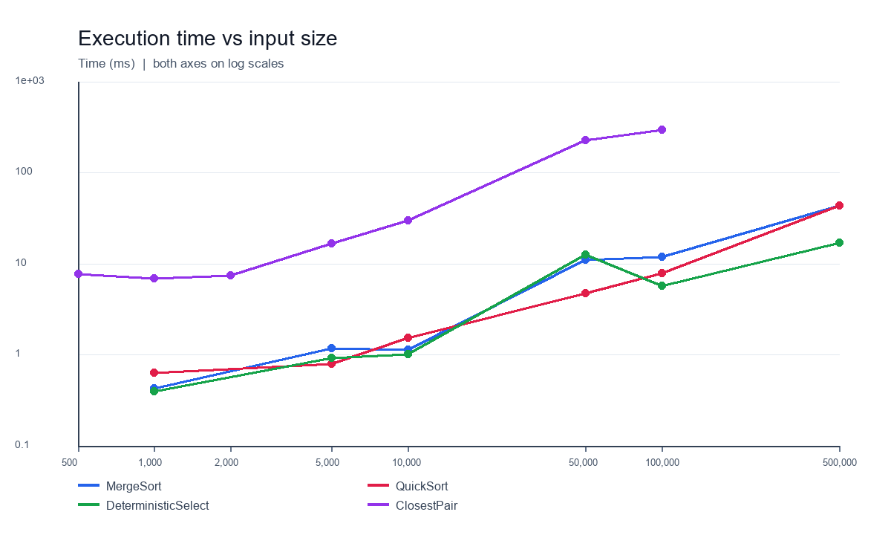
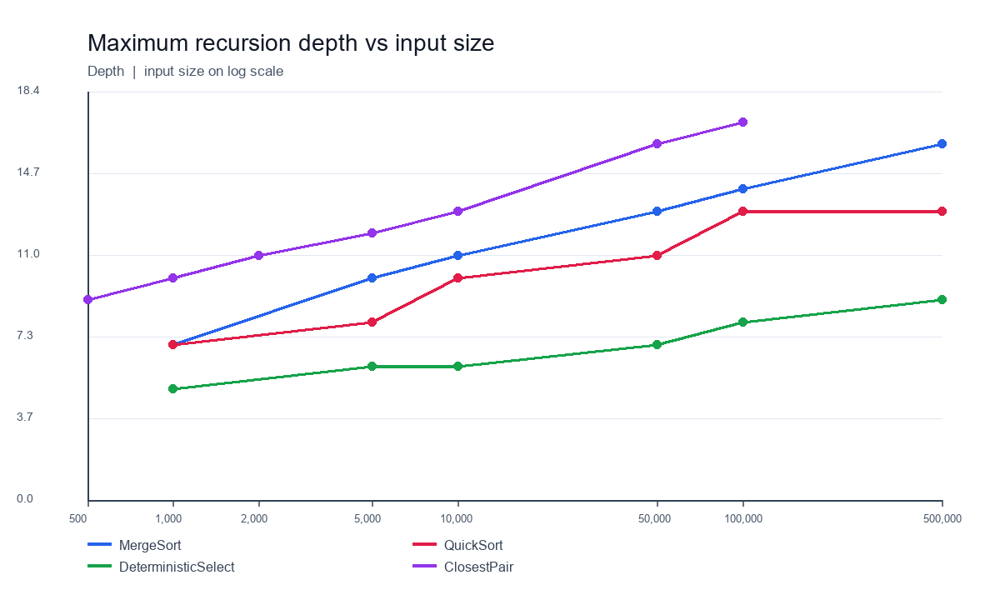
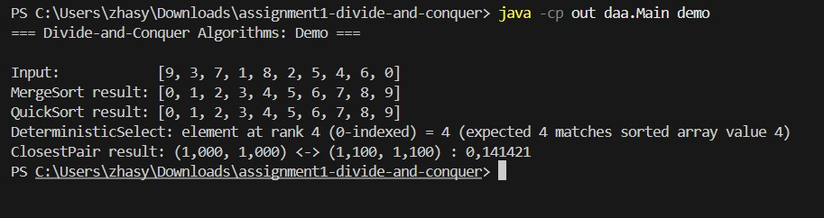
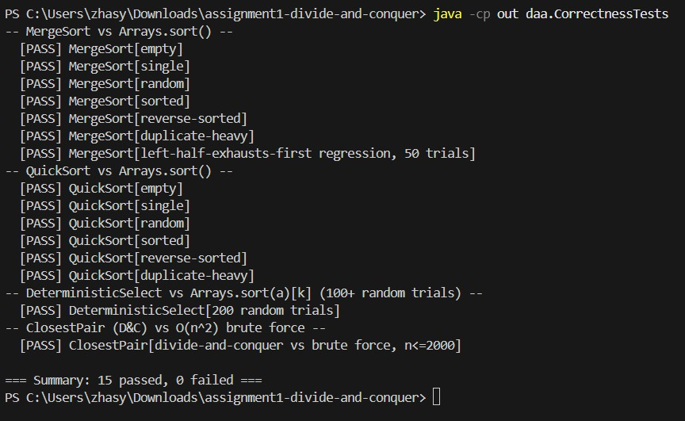
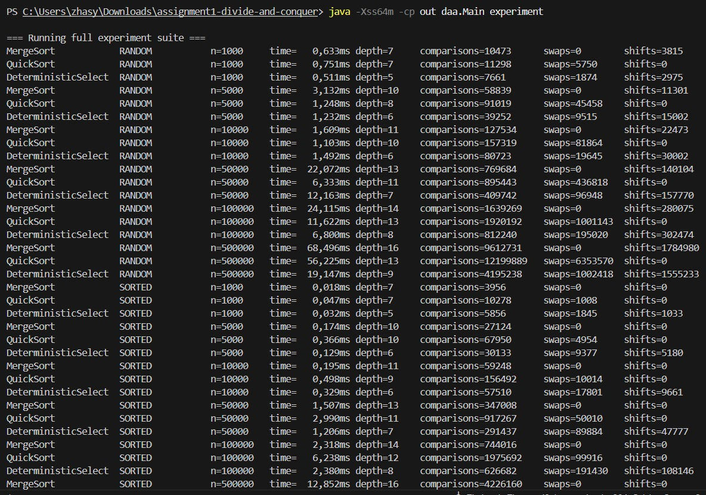

# Assignment 1: Divide-and-Conquer Algorithm Analysis

**Author:** Zhalynuly Zhassyn · **Group:** SE-2527 · **Course:** Design and Analysis of Algorithms

## Short explanation

This project solves four problems with divide and conquer. Each algorithm splits a problem into smaller parts, solves them, and combines the results. I compared the theoretical running time with measurements from Java.

| Algorithm | Main idea | Time |
|---|---|---|
| MergeSort | Sort two halves, then merge them | Θ(n log n) |
| Randomized QuickSort | Partition around a random pivot | Θ(n log n) expected for distinct values; O(n²) worst case |
| Deterministic Select | Use the median of medians to find the k-th value | Θ(n) worst case |
| Closest Pair | Solve left and right halves, then check a narrow strip | Θ(n log n) |

The main lesson: a good split controls the amount of work. MergeSort always splits evenly; Median-of-Medians guarantees a useful pivot; QuickSort uses randomness to get good splits on average.

## A. Project overview

The project implements all four algorithms in Java. It measures execution time with System.nanoTime(), maximum recursion depth, and operation counts. Experiments use random, sorted, reverse-sorted, and duplicate-heavy arrays where applicable. Results are saved in [results/results.csv](results/results.csv).

The source code is in [src/daa](src/daa), correctness tests are in [tests/daa/CorrectnessTests.java](tests/daa/CorrectnessTests.java), and figures and screenshots are in [docs](docs).

## B. Algorithm analysis

### 1. MergeSort

Split the array in half, sort both halves recursively, and merge them in linear time. One reusable buffer stores merge data. For subarrays of 16 elements or fewer, Insertion Sort avoids extra recursive calls.

**Recurrence:** T(n) = 2T(n/2) + Θ(n). The two recursive halves and the linear merge give Θ(n log n) by the balanced case of the Master Theorem. **Extra space:** O(n) for the buffer.

### 2. Randomized QuickSort

Choose a random pivot and partition the array in place. Recurse on the smaller partition and process the larger one with a loop. This keeps the call stack at O(log n), even if a pivot gives a poor split.

**Time:** Θ(n log n) expected for distinct values; O(n²) in the worst case. This implementation also takes quadratic time when all values are equal because its partition has only two groups. **Extra space:** O(log n) stack.

The split depends on the random pivot, so the equal-size Master Theorem does not directly apply. Averaging over all pivot positions gives the expected Θ(n log n) result.

### 3. Deterministic Select (Median-of-Medians)

To find the value at index k in sorted order, divide values into groups of five, find each group median, and select the median of those medians as a pivot. Partition into values smaller than, equal to, and larger than the pivot. Continue only in the part containing k; an equal value can be returned immediately.

**Recurrence:** T(n) ≤ T(n/5) + T(7n/10) + Θ(n), ignoring rounding and constant-size groups. The total size of recursive subproblems is at most about 9n/10, so work decreases at each level. This gives **Θ(n) worst-case time** by recursion-tree / Akra–Bazzi intuition. **Extra space:** O(log n) stack.

The three-way partition matters for duplicates: it removes all values equal to the pivot in one pass.

### 4. Closest Pair of Points

Sort points by x and y. Split at the middle x-coordinate, solve both halves recursively, and keep the smaller distance δ. Check points within δ of the split line in y order. Only a constant number of nearby points need to be checked for each point in the strip.

**Recurrence:** T(n) = 2T(n/2) + Θ(n). The strip check is linear at each level, so the Master Theorem gives **Θ(n log n) time**. **Extra space:** O(n) for sorted arrays and recursive splits. Brute force checks every pair and takes Θ(n²).

## C. Experimental results

These are single-run measurements on JDK 26. Times can vary because of JVM warm-up, garbage collection, and other machine activity. Full data for every size and input type is in [results/results.csv](results/results.csv).

### Time on random input (milliseconds)

| n | MergeSort | QuickSort | Select | Closest Pair |
|---:|---:|---:|---:|---:|
| 1,000 | 0.429 | 0.631 | 0.402 | 6.886 |
| 5,000 | 1.190 | 0.803 | 0.936 | 16.683 |
| 10,000 | 1.146 | 1.536 | 1.014 | 29.995 |
| 50,000 | 11.138 | 4.766 | 12.743 | 230.307 |
| 100,000 | 11.920 | 7.886 | 5.710 | 295.748 |
| 500,000 | 43.986 | 43.861 | 17.104 | — |

Closest Pair was measured up to 100,000 points. Its full size range also includes 500 and 2,000 points.

### Time by input type at n = 100,000 (milliseconds)

| Input | MergeSort | QuickSort | Select |
|---|---:|---:|---:|
| Random | 11.920 | 7.886 | 5.710 |
| Sorted | 2.648 | 4.327 | 2.310 |
| Reverse-sorted | 5.623 | 6.845 | 3.141 |
| Duplicate-heavy | 14.689 | 9.565 | 4.174 |

### Maximum recursion depth on random input

| n | MergeSort | QuickSort | Select | Closest Pair |
|---:|---:|---:|---:|---:|
| 1,000 | 7 | 7 | 5 | 10 |
| 5,000 | 10 | 8 | 6 | 12 |
| 10,000 | 11 | 10 | 6 | 13 |
| 50,000 | 13 | 11 | 7 | 16 |
| 100,000 | 14 | 13 | 8 | 17 |
| 500,000 | 16 | 13 | 9 | — |

Depth grows slowly as n increases. The CSV also contains comparisons, swaps, and shifts. These counters describe different operations, so they should not be compared as identical units across all algorithms.

**Correctness checks:** 16 tests passed. MergeSort and QuickSort were compared with Arrays.sort() on random, sorted, reverse-sorted, duplicate-heavy, empty, and single-element arrays. Select passed 200 random comparisons with Arrays.sort(a)[k] and an all-equal regression test. Closest Pair was compared with brute force on datasets up to 2,000 points.

### Plots

Time plots use logarithmic axes so that the four algorithms fit on one chart.





Additional plots: [QuickSort by input type](docs/plots/quicksort_time_by_input_type.png) and [comparisons vs input size](docs/plots/comparisons_vs_n.png).

## D. Discussion

**Do results match theory?** Broadly, yes: on random input, MergeSort, QuickSort, and Closest Pair show approximately n log n growth; Select grows approximately linearly. A single timing run is evidence, not a proof. The operation counters help check the trend, although Closest Pair's counter does not include initial sorting or base-case distance checks.

**Does input order matter?** MergeSort remains Θ(n log n), though sorted runs can use fewer comparisons. A random pivot helps QuickSort avoid the usual sorted-input problem. Duplicate values can still make its two-way partition slow. Select's three-way partition handles equal values together.

**Why recurse on the smaller QuickSort partition?** Each recursive call handles at most half of the current elements, so maximum stack depth is O(log n). This does not remove QuickSort's O(n²) worst-case running time.

**Why is Select linear in the worst case?** The median-of-medians pivot removes a constant fraction of candidates at each step. The recurrence T(n/5) + T(7n/10) + Θ(n) sums to Θ(n).

**Why is Closest Pair faster than brute force?** Brute force checks Θ(n²) pairs. Divide and conquer checks only a linear-size strip at each of about log n levels, for Θ(n log n) total work.

**Why do measured times vary?** The JVM compiles frequently used code during execution; CPU caches and garbage collection also affect timing. The experiment has no separate warm-up or repeated-trial averaging, so small differences should not be over-interpreted.

## E. Reflection

This assignment helped me distinguish expected time from worst-case time. Randomized QuickSort is usually fast, but its result depends on pivot quality and duplicate values. Median-of-Medians does more work to choose a pivot, but guarantees linear worst-case time.

The main implementation challenges were measuring QuickSort's recursion depth correctly and keeping Closest Pair's strip in y order without sorting again at every level. I also learned that experiments must handle duplicate values and save numbers in a consistent CSV format.

## F. Screenshots

These screenshots illustrate program output and testing; the CSV and plots above contain the latest experiment data.







## Run the project

From the repository root in PowerShell:

```powershell
New-Item -ItemType Directory -Force out | Out-Null
$sources = @(Get-ChildItem src/daa -Filter '*.java' | ForEach-Object FullName)
$sources += (Resolve-Path tests/daa/CorrectnessTests.java).Path
javac -d out $sources
java -cp out daa.Main demo
java -cp out daa.CorrectnessTests
java -cp out daa.Main experiment
```

To rebuild the plots from the CSV, install Pillow and run the script:

```powershell
python -m pip install Pillow
python docs/plots/make_plots.py
```

The repository includes [pom.xml](pom.xml), [results](results), plots, screenshots, and separate source and test directories. The Git history records the implementation steps. Submit the repository URL as required by the assignment.
